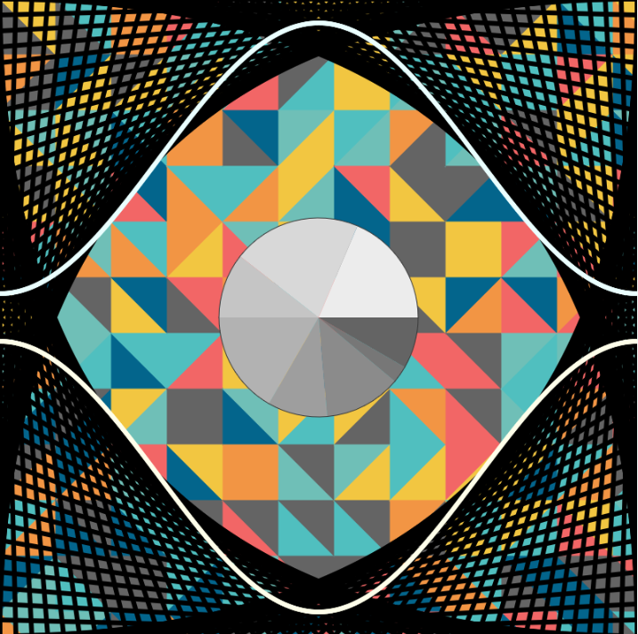

<h1 align="center">EYE</h1>
<p align="center"><a href="https://laravel.com" target="_blank"></a></p>

<p align="center">
<a href="https://editor.p5js.org/"></a>
</p>
<h1 align="center"></h1>

## Primitif 2D

Dengan menggunakan P5.js buatlah sebuah karya kreatif berupa sebuah gambar/lukisan digital dengan memanfaatkan grafika primitif 2D di p5.js. Karya yang dibuat terserah Anda. Bisa pemandangan, objek, karakter, atau lainnya. Tujuan tugas ini agar Anda terbiasa dengan sistem koordinat di p5.js & menggunakan fungsi dasar di p5.js, bukan mengevaluasi bagus tidaknya. Berkreasilah 😉

Menggunakan berbagai grafik primitif di p5.js: 
 - [titik](https://p5js.org/reference/#/p5/point) (point)
 ``` 
 - Fungsi point() membuat titik pada koordinat (x,y) yang ditentukan. Ini pada dasarnya sama seperti “menyalakan” piksel pada koordinat 
      tertentu (digraphic API lain seperti fungsi PutPixel() )
 - Terdapat dua parameter x, y dan satu parametertambahan (opsional): z yang menentukan letakkoordinat titik tersebut
 - Hasil titik dari fungsi point() ini dipengaruhi olehfungsi atribut stroke() untuk warna titiknya, danstrokeWeight() untuk besar titiknya
 ```
 - [garis](https://p5js.org/reference/#/p5/line) (line)
 ```
 - Fungsi line() membuat garis berdasarkan koordinat dua titik yang ditentukan oleh empat parameter fungsi: x1, y1, x2, y2. Dalam bidang 3D fungsi ini bisa digunakan dengan ditambahkanparameter koordinat z.
 - Garis yang dibentuk oleh fungsi line() dipengaruhi fungsi atribuat stroke() untuk warna garis, strokeCap() untuk bentuk ujung garis, dan strokeWeight() untuk tebal garis.

 ```
 - [segitiga](https://p5js.org/reference/#/p5/triangle) (triangle)
 ```
 • Fungsi triangle() membuat segitiga berdasarkan koordinat tiga titik yang ditentukan oleh enam parameter fungsi: x1, y1, x2, y2, x3, y3.
 • Untuk fungsi grafika primitif yang membentuk poligon seperti segitiga, fungsi atribut yang mempengaruhi adalah sebagai berikut:
    • stroke() – warna garis keliling poligon
    • noStroke() – meniadakan garis keliling poligon
    • strokeWeight() – tebal garis keliling poligon
    • strokeJoin() – bentuk garis di sudut poligon:
        MITER (sudut tajam), BEVEL (sudut rata), ROUND(sudut bulat) 
    • fill() – menentukan warna yang mengisi poligon
    • noFill() – meniadakan warna yang mengisi poligon
 ```
 - [segi empat](https://p5js.org/reference/#/p5/quad) (quad, rect, square) 
 ```
• Fungsi quad() membuat segi empat berdasarkan koordinat empat titik yang ditentukan oleh delapan parameter fungsi: x1, y1, x2, y2, x3, y3, x4, y4.
• Juga terdapat parameter koordinat z untuk digunakan dalam bidang 3D
• Perlu diperhatikan: letak titik harus “berurutan” searah jarum jam (clockwise) atau melawan arah jaruh jam – jika tidak bentuknya akan kacau
• Seperti segitiga, fungsi quad() dipengaruhi fungsi atribut yang sama

 ```
 - [lingkaran](https://p5js.org/reference/#/p5/ellipse) (ellipse, circle)
 ```
• Fungsi ellipse() membuat sebuah elips berdasarkan koordinat titik tengah acuan pembentukan: (x, y), serta ukuran panjang dan
   tinggi dari diameter tengah elips.
• Untuk fungsi ellipse() ini, selain bisa diatur dengan fungsi atribut, juga bisa diatur secara khusus dengan ellipseMode() – untuk mengatur
   cara kerja pembentukannya seperti fungsi rectMode() terhadap rect() atau square() – hanya saja mode default dari fungsi elips adalah CENTER
 ```
 - [busur](https://p5js.org/reference/#/p5/arc) (arc)
 ```
• Fungsi arc() untuk membentuk garis busur atau lingkaran parsial berdasarkan sebuah lingkaran/elips yang ditentukan koordinat, serta
   lebar dan tingginya
• busur dan sebagian lingkaran dibuat  berdasarkan lingkaran tersebut
• Busur yang dibentuk dipengaruhi fungsi atribut sama seperti primitif lainnya seperti stroke(), fill(), dsb.
• Juga terdapat mode seperti rectMode() atau ellipseMode() untuk busur yang menjadi parameter dalam fungsinya – bukan fungsi sendiri
• Cara kerja busur membutuhkan pemanfaatan sudut (angle) dalam derajat (°) atau sudut dalam radians
 ```


